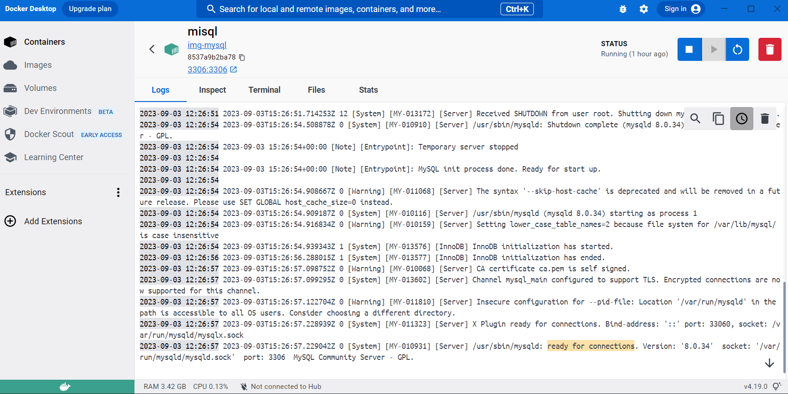
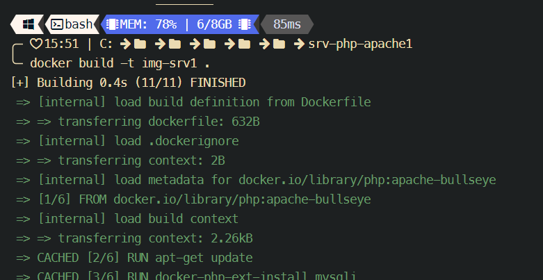
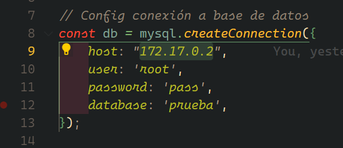
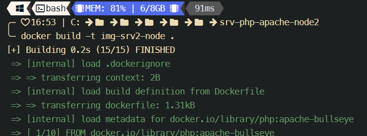
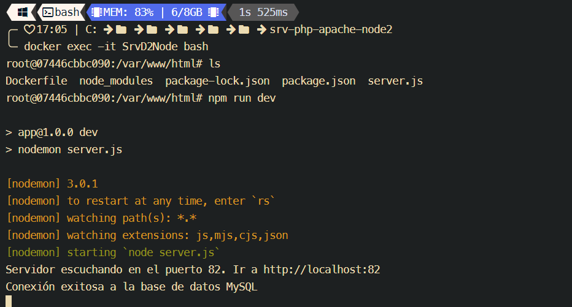
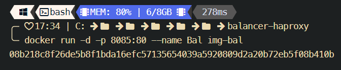

# <u>Introducción:</u>
> Este repo fue desarrollado para responder a ciertas cuestiones planteadas por la materia *"Seminario de Actualización III"* del **Instituto Politécnico de Formosa**.
> Se trata del manejo y administración de servidores ejecutándose en contenedores de **Docker** con un balanceador de carga **HaProxy**, también corriendo en un contenedor. Estos servidores a su vez hacen una consulta a una base de datos **MySql** alojada, otra vez, dentro de un contenedor de Docker.

La parte principal del trabajo se basa en la ejecución de los siguientes dos comandos:
* Construcción de imagen. Situarse en el directorio donde se encuentra el Dockerfile y ejecutar:
```
docker build -t <nombre_imagen> .
```

* Luego crear el contenedor utilizando esta imagen:
```
docker run -d -p <puerto_maquina_local>:<puertro_que_expone_el_contenedor> --name <nombre_contendor> <imagen_base>
```

# <u>Desarrollo:</u>

### Creación imagen y contenedor MySQL

##### Dockerfile:
```
FROM mysql:debian

ENV MYSQL_ROOT_PASSWORD=pass
ENV MYSQL_DATABASE=prueba

# Copiamos el fichero datos.sql dentro del directorio `/docker-entrypoint-initdb.d`.
# Cuando se inicia un contenedor por primera vez, se creará e inicializará una nueva base de datos con el nombre especificado en las variables de configuración proporcionadas.  Además, ejecutará archivos con extensiones .sh, .sql y .sql.gz. que se encuentran en `/docker-entrypoint-initdb.d`
COPY ./ /docker-entrypoint-initdb.d

EXPOSE 3306

```

##### Comandos:

* Construcción de la imagen. Abrimos un CLI y nos situamos en el directorio donde tenemos nuestro Dockerfile para formar la imagen de MySQL. Ejecutamos:
```
docker build -t img-mysql .
```


* Luego crear el contenedor del servidor utilizando esta imagen:
```
docker run -d -p 3306:3306 -v "C:\sqlVol":/var/lib/mysql --name misql img-mysql
```


	Vemos que hemos creado el volumen "C:\sqlVol" para que nuestra base de datos no se pierda en caso de agregar nuevos datos y eliminar el contenedor.

**Esperamos uno o dos minutos** para *dejar que el contenedor inicie completamente* y nuestra base de datos esté _lista para realizar conexiones_.



* Ingresamos al contenedor:
```
docker exec -it misql bash
```

* Verificamos que efectivamente, nuestra base de datos se haya creado correctamente. Ejecutamos el siguiente comando para realizar consultas a la base de datos:
```
mysql -u root -p
```

E ingresamos nuestra contraseña, en este caso será:
```
pass
```

Ya que esta es la contraseña que establecimos en las variables de entorno de nuestro Dockerfile al crear la imagen.


* Verificamos que nuestra base de datos, y la tabla del fichero  se hayan creado correctamente:
```
show databases;
```

```
use pueba;
```

```
SELECT * FROM alumnos;
```


* Si no existen tales datos, los agregamos a mano:
```
-- Crear la base de datos "prueba"
CREATE DATABASE IF NOT EXISTS prueba;

USE prueba;

CREATE TABLE IF NOT EXISTS alumnos (
    id INT AUTO_INCREMENT PRIMARY KEY,
    apellidos VARCHAR(200),
    nombres VARCHAR(200),
    dni INT(11)
);

INSERT INTO alumnos (apellidos, nombres, dni) VALUES
    ('Luffy', 'Monkey D.', 123456789),
    ('Ronoroa', 'Zoro', 123456789),
    ('-', 'Nami', 123123213),
    ('-', 'Usopp', 456456456),
    ('-', 'Sanji', 456456464),
    ('Chopper', 'Tony Tony', 456456789),
    ('Robin', 'Nico', 12332131),
    ('-', 'Franky', 123789798),
    ('-', 'Brook', 00000000);
```


### Creación imágenes y contenedores *PHP:APACHE-BULLSEYE*

#### Primer servidor con PHP

##### Dockerfile:

```

# Usamos la imagen base de php:apache-bullseye
FROM php:apache-bullseye

# Actualizamos los repositorios y luego instalamos el paquete necesario

RUN apt-get update
# RUN apt-get install -y libmysqli-dev
RUN docker-php-ext-install mysqli
RUN docker-php-ext-enable mysqli

# Establecemos el directorio de trabajo
WORKDIR /var/www/html

# Copiamos el contenido del directorio local a /var/www/html en el contenedor
COPY ./ /var/www/html/

# Exponemos el puerto 80
EXPOSE 80

# Comando para iniciar el servidor Apache cuando se inicie el contenedor
CMD ["apache2-foreground"]

```

##### Comandos:

* Antes de crear la imagen, debemos verificar la dirección IP del contenedor que aloja nuestra base de datos, ya que es a esta IP a la que tendrá que apuntar nuestro servidor para que la consulta a la base de datos se haga correctamente. Ver fichero:  
Para conocer la dirección IP del contenedor de la BD ejecutamos:
```
docker inspect misql
```


**Esta dirección IP debe coincidir con la IP configurada en el `index.php` para hacer la conexión a la BD**


* Construcción de la imagen. Abrimos un CLI y nos situamos en el directorio donde tenemos nuestro Dockerfile para formar la imagen de PHP:APACHE-BULSSEYE. Ejecutamos:
```
docker build -t img-srv1 .
```




* Luego crear el contenedor del servidor utilizando esta imagen:
```
docker run -d -p 8090:80 --name SrvD1 img-srv1
```


* Verificamos el funcionamiento del servidor y su correcta conexión al contenedor de BD ingresando con cualquier navegador a:
```
http://localhost:8090/
```


#### Segundo servidor con PHP
##### Dockerfile:

```
  
# Usamos la imagen base de php:apache-bullseye
FROM php:apache-bullseye

# Actualizamos los repositorios y luego instala el paquete necesario
RUN apt-get update
# RUN apt-get install -y libmysqli-dev
RUN docker-php-ext-install mysqli
RUN docker-php-ext-enable mysqli

# Establecemos el directorio de trabajo
WORKDIR /var/www/html

# Copiamos el contenido del directorio local a /var/www/html en el contenedor
COPY ./ /var/www/html/

# Exponemos el puerto 80
EXPOSE 80

# Comando para iniciar el servidor Apache cuando se inicie el contenedor
CMD ["apache2-foreground"]

```


##### Comandos:


* Antes de crear la imagen, debemos verificar la dirección IP del contenedor que aloja nuestra base de datos, ya que es a esta IP a la que tendrá que apuntar nuestro servidor para que la consulta a la base de datos se haga correctamente. Ver fichero:  
Para conocer la dirección IP del contenedor de la BD ejecutamos:
```
docker inspect misql
```


**Esta dirección IP debe coincidir con la IP configurada en el `index.php` para hacer la conexión a la BD**


* Construcción de la imagen. Abrimos un CLI y nos situamos en el directorio donde tenemos nuestro Dockerfile para formar la imagen de PHP:APACHE-BULSSEYE. Ejecutamos:
```
docker build -t img-srv2 .
```


* Luego crear el contenedor del servidor utilizando esta imagen:
	```
	docker run -d -p 8091:80 --name SrvD2 img-srv2
	```


* Verificamos el funcionamiento del servidor y su correcta conexión al contenedor de BD ingresando con cualquier navegador a:
```
http://localhost:8091/
```


### Creación imágenes y contenedores *PHP:APACHE-BULLSEYE + **NODEJS***

#### Primer servidor con NodeJS

##### Dockerfile:

```
# Utilizamos la imagen base de php:apache-bullseye

FROM php:apache-bullseye

# Establecemos el directorio de trabajo
WORKDIR /var/www/html

# Copiamos el contenido del directorio local a /var/www/html en el contenedor
COPY ./ /var/www/html/

# Exponemos el puerto 81. Este puerto debe ser el mismo que se utiliza para crear el servidor y, al crear el contenedor, cuando hacemos el mapeo de puertos, el puerto del contenedor debe ser igual al puerto expuesto aquí.
EXPOSE 81

# Instalamos NodeJS (ver pasos en: https://github.com/nodesource/distributions/blob/master/README.md#debian-versions)
RUN apt-get update
RUN apt-get install -y ca-certificates curl gnupg
RUN mkdir -p /etc/apt/keyrings
RUN curl -fsSL https://deb.nodesource.com/gpgkey/nodesource-repo.gpg.key | gpg --dearmor -o /etc/apt/keyrings/nodesource.gpg
# Elgimos la versión 16
RUN NODE_MAJOR=16 && \
    echo "deb [signed-by=/etc/apt/keyrings/nodesource.gpg] https://deb.nodesource.com/node_$NODE_MAJOR.x nodistro main" | tee /etc/apt/sources.list.d/nodesource.list

RUN apt-get update && \
    apt-get install nodejs -y

# Una vez instalado node, ya podemos hacer la instalación de dependencias para ejecutar nuestro servidor.
RUN npm install

CMD ["apache2-foreground"]
```

Aquí seguimos la instalación de Node de acuerdo a los pasos dados en: https://github.com/nodesource/distributions/blob/master/README.md#debian-versions.
Se llegó a este link leyendo la documentación oficial(https://nodejs.org/es/download/package-manager).

##### Comandos:

* Antes de crear la imagen, debemos verificar la dirección IP del contenedor que aloja nuestra base de datos, ya que es a esta IP a la que tendrá que apuntar nuestro servidor para que la consulta a la base de datos se haga correctamente. Ver fichero:  
Para conocer la dirección IP del contenedor de la BD ejecutamos:
```
docker inspect misql
```


**Esta dirección IP debe coincidir con la IP configurada en el `server.js` para hacer la conexión a la BD**



* Construcción de la imagen. Abrimos un CLI y nos situamos en el directorio donde tenemos nuestro Dockerfile para formar la imagen de PHP:APACHE-BULSSEYE con NodeJS instalado en su interior. Ejecutamos:

```
docker build -t img-srv1-node .
```


* Luego crear el contenedor del servidor utilizando esta imagen:
```
docker run -d -p 8092:81 --name SrvD1Node img-srv1-node
```


Aquí el puerto del contenedor que debemos mapear es el mismo que se utiliza en el código .js que crea el servidor. Ver fichero 

* Ingresamos al contenedor:
```
docker exec -it SrvD1Node bash
```

* Ejecutamos el servidor de NodeJS que se encuentra en el segundo contenedor:
```
npm run dev
```


* Verificamos el funcionamiento del servidor y su correcta conexión al contenedor de BD ingresando con cualquier navegador a:
```
http://localhost:8092/
```


#### Segundo servidor con NodeJS
##### Dockerfile:

```
  

# Utilizamos la imagen base de php:apache-bullseye
FROM php:apache-bullseye

# Establecemos el directorio de trabajo
WORKDIR /var/www/html

# Copiamos el contenido del directorio local a /var/www/html en el contenedor
COPY ./ /var/www/html/

# Exponemos el puerto 82. Este puerto debe ser el mismo que se utiliza para crear el servidor y, al crear el contenedor, cuando hacemos el mapeo de puertos, el puerto del contenedor debe ser igual al puerto expuesto aquí.
EXPOSE 82

# Instalamos NodeJS (ver pasos en: https://github.com/nodesource/distributions/blob/master/README.md#debian-versions)
RUN apt-get update
RUN apt-get install -y ca-certificates curl gnupg
RUN mkdir -p /etc/apt/keyrings
RUN curl -fsSL https://deb.nodesource.com/gpgkey/nodesource-repo.gpg.key | gpg --dearmor -o /etc/apt/keyrings/nodesource.gpg
# Elgimos la versión 16
RUN NODE_MAJOR=16 && \
    echo "deb [signed-by=/etc/apt/keyrings/nodesource.gpg] https://deb.nodesource.com/node_$NODE_MAJOR.x nodistro main" | tee /etc/apt/sources.list.d/nodesource.list

RUN apt-get update && \
    apt-get install nodejs -y

# Una vez instalado node, ya podemos hacer la instalación de dependencias para ejecutar nuestro servidor.
RUN npm install

CMD ["apache2-foreground"]

```

Aquí seguimos la instalación de Node de acuerdo a los pasos dados en: https://github.com/nodesource/distributions/blob/master/README.md#debian-versions.
Se llegó a este link leyendo la documentación oficial(https://nodejs.org/es/download/package-manager).

##### Comandos:

* Antes de crear la imagen, debemos verificar la dirección IP del contenedor que aloja nuestra base de datos, ya que es a esta IP a la que tendrá que apuntar nuestro servidor para que la consulta a la base de datos se haga correctamente. Ver fichero:  

Para conocer la dirección IP del contenedor de la BD ejecutamos:
```
docker inspect misql
```


**Esta dirección IP debe coincidir con la IP configurada en el `server.js` para hacer la conexión a la BD**


* Construcción de la imagen. Abrimos un CLI y nos situamos en el directorio donde tenemos nuestro Dockerfile para formar la imagen de PHP:APACHE-BULSSEYE con NodeJS instalado en su interior. Ejecutamos:
```
docker build -t img-srv2-node .
```



* Luego crear el contenedor del servidor utilizando esta imagen:
```
docker run -d -p 8093:82 --name SrvD2Node img-srv2-node
```


Aquí el puerto del contenedor que debemos mapear es el mismo que se utiliza en el código .js que crea el servidor. Ver fichero 

* Ingresamos al contenedor:
```
docker exec -it SrvD2Node bash
```

* Ejecutamos el servidor de NodeJS que se encuentra en el segundo contendor:
```
npm run dev
```




* Verificamos el funcionamiento del servidor y su correcta conexión al contenedor de BD ingresando con cualquier navegador a:
```
http://localhost:8093/
```


### Creación imagen y contenedor *HAPROXY*:

##### Dockerfile:
```
FROM haproxy:latest

WORKDIR /usr/local/etc/haproxy

COPY ./ /usr/local/etc/haproxy

EXPOSE 80

```

##### Comandos:

* Antes de crear la imagen, debemos verificar las direcciones IP's de los contenedores que alojan los distintos servidores que usaremos para "balancear", ya que es a estas IP a la que tendrá que apuntar nuestro balanceador en su configuración. Ver fichero:  

Para conocer la dirección IP de un contenedor ejecutamos:
```
docker inspect <tag_contenedore>
```

En nuestro caso tenemos:
* SrvD1: "172.17.0.3"
* SrvD2: "172.17.0.4"
* SrvD1Node: "172.17.0.5"
* SrvD2Node: "172.17.0.6"

**Estas direcciones IP deben coincidir con las IP configuradas en el `haproxy.cfg` para  el correcto funcionamiento del balanceador**


* Construcción de la imagen. Abrimos un CLI y nos situamos en el directorio donde tenemos nuestro Dockerfile para formar la imagen de Haproxy. Ejecutamos:
```
docker build -t img-bal .
```


* Creamos el contenedor del balanceador
```
docker run -d -p 8085:80 --name Bal img-bal
```




**Esperamos uno o dos minutos** para *dejar que el contenedor inicie completamente*.

* Verificamos el funcionamiento del balanceador y su correcto comportamiento ingresando con cualquier navegador a:
```
http://localhost:8085/
```

**Asegurarse antes de tener todos los contenedores ejecutándose y, en el caso de los servidores con NodeJS, que todos los servidores estén en funcionamiento**


